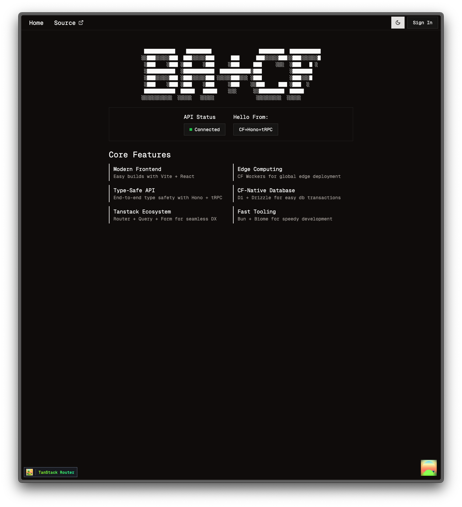

# Better-Cloud

Better-Cloud is a modern, full-stack starter kit built for Cloudflare Workers. It combines a React + Vite frontend with an edge-deployed backend powered by Hono, tRPC, Drizzle ORM, and Cloudflare D1 & KV. Authentication is handled via Better Auth with email OTP and social OAuth login, and state management is seamlessly integrated using the TanStack ecosystem.

<p align="center">
  
</p>

## Table of Contents

- [Tech Stack](#tech-stack)
- [Getting Started](#getting-started)
  - [Prerequisites](#prerequisites)
  - [Environment Variables](#environment-variables)
  - [Installation](#installation)
  - [Development](#development)
  - [Building, Preview, Deploy](#building-preview)
- [Database](#database)
- [Authentication](#authentication)
- [Project Structure](#project-structure)
- [Deployment](#deployment)
- [License](#license)

---

## Tech Stack

- 🖥️ **Frontend**: React 19, TypeScript, Vite for fast builds & HMR
- 🔄 **Routing & Data**: Tanstack Router, Query, and Form
- 🎨 **Styling**: Tailwind CSS, shadcn/ui components, sonner toast notifications
- 🌐 **Backend**: Hono on Cloudflare Workers, end-to-end type-safe API with tRPC & Zod
- 💾 **Database**: Cloudflare D1 via Drizzle ORM with migrations & local SQLite file for development
- 🔒 **Authentication**: Email OTP & social OAuth using Better Auth, session caching in CLoudflare KV
- 🌍 **Edge-First Deployment**: Cloudflare Workers provides a global CDN and cache for fast rendering
- 🧰 **Tooling**: Biome for linting/formatting, Bun for package management, Wrangler for deployments

## Getting Started

### Prerequisites

- Node.js v18+ or Bun v1.2+ installed
- Wrangler CLI (`npm install -g wrangler`)
- Cloudflare account with D1 & KV namespaces for production

### Environment Variables

Copy `.dev.vars.example` to `.dev.vars` and fill in the values.

Copy `.env.example` to `.env` and fill in the values.

### Installation

```bash
bun install
```

### Development

Copy `wrangler.example.jsonc` to `wrangler.jsonc` and update it with your own app data and bindings. Then, every time you edit the `wrangler.jsonc` file, make sure to run `bun cf:typegen` to update the `worker-configuration.d.ts` file with the latest types.

Start local Vite server and Workers server separately:

```bash
bun dev     // starts frontend server at http://localhost:5173
bun cf:dev  // starts workers server at http://localhost:8787
```
As far as I can tell so far, it is necessary to launch both servers in order to get social OAuth login to function properly in local development. Using only the Vite server (and setting all local url env vars to localhost:5173) returns a "Not Found" error when attempting social login. But if you know a way around this error, please do let me know!

### Build, Preview, Deploy

```bash
bun build     // creates static assets bundle in ./dist/
bun preview   // preview prod build available at http://localhost:4173
bun cf:deploy // deploys production build to live site, either at *.username.workers.dev or custom domain 
```

## Database

- Managed with Drizzle ORM & D1
- Local SQLite stored under `.wrangler/`

| Script                    | Description                              |
| ------------------------- | ---------------------------------------- |
| `npm run db:migrate`      | Apply migrations to local SQLite DB      |
| `npm run db:migrate:prod` | Apply migrations on remote Cloudflare D1 |
| `npm run db:studio`       | Launch Drizzle Studio for local DB       |
| `npm run db:studio:prod`  | Launch Drizzle Studio for prod DB        |

## Authentication

- Email OTP flows via Better Auth plugin
- Social logins using Google & GitHub
- Session data cached in KV namespace (`SESSION_KV`)
- All auth endpoints under `/api/auth/*`

## Project Structure

```
/ (root)
├── src
│   ├── client                    # Frontend application
│   │   ├── components            # UI & navigation components
│   │   ├── routes                # Pages & layouts (TanStack Router)
│   │   ├── lib                   # TRPC client, auth-client, theme-provider
│   │   ├── index.css             # Tailwind & custom theming
│   │   └── routeTree.gen.ts      # Auto-generated route definitions
│   ├── server                    # Backend application on Workers
│   │   ├── routers               # tRPC routers (health, guestbook, user)
│   │   ├── middlewares           # Hono middleware (auth/db, CORS, session)
│   │   ├── db                    # Drizzle schema, migrations, utils
│   │   └── lib                   # Auth setup, TRPC init, type definitions
├── dist                          # Production build output
├── wrangler.jsonc                # Cloudflare Workers configuration
├── worker-configuration.d.ts     # CF types generated with `wrangler types`
├── vite.config.ts                # Vite plugin configuration
├── drizzle.config.ts             # Drizzle-kit configuration
├── .env                          # Local env variables
└── .dev.vars                     # Local Cloudflare env variables
```

## Deployment

Deploy to Cloudflare Workers & D1:

```bash
bun cf:deploy
# or
bunx wrangler deploy
```

## License

MIT License